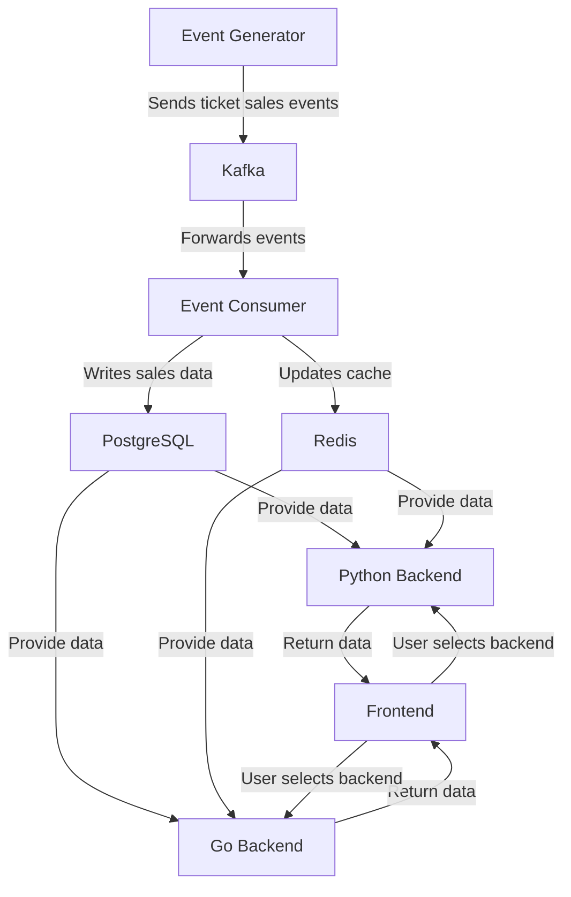

# ReelMetrics

ReelMetrics is a distributed system that processes theater ticket sales in real time. It leverages **Kafka** for event streaming, **PostgreSQL** for persistent storage, and **Redis** for caching frequently accessed data. The system includes both **Python (FastAPI)** and **Go** backends to demonstrate multi-language interoperability.

## **🚀 Architecture Overview**


## **🛠️ Tech Stack**
- **Backend (Python - FastAPI)**: Exposes APIs to fetch theaters & movie sales.
- **Backend (Go)**: Alternative implementation for fetching the same data.
- **PostgreSQL**: Stores theaters, movies, and sales data.
- **Redis**: Caches frequently accessed data (e.g., top theaters, movie sales).
- **Kafka**: Streams real-time ticket purchase events.
- **Frontend (React)**: Displays theaters, movies, and sales statistics.

## **📦 Setup & Installation**

### **1️⃣ Clone the Repository**
```bash
git clone https://github.com/yourusername/reelmetrics.git
cd reelmetrics
```

### **2️⃣ Start the Services with Docker**
```bash
docker-compose up -d
```

### **3️⃣ Verify Running Services**
```bash
docker ps
```

### **4️⃣ Test API Endpoints**

#### **Get Theaters (Python Backend)**
```bash
curl -X GET http://localhost:8001/theaters
```

#### **Get Movies & Sales for a Theater (`id=1`)**
```bash
curl -X GET http://localhost:8001/theaters/1/movies
```

#### **Get Top Theater by Revenue (Go Backend)**
```bash
curl -X GET http://localhost:8002/top-theater/2024-05-10
```

## **🎬 Project Components**

### **1️⃣ Event Generator**
- Generates **random ticket sales events**.
- Publishes events to **Kafka**.

### **2️⃣ Backends (Python & Go)**
- **Fetch theaters & movie sales from PostgreSQL**.
- **Cache results in Redis** to optimize performance.

### **3️⃣ Frontend (React)**
- Lets users select between **Python & Go backends**.
- Displays **real-time revenue statistics**.

## **🔧 Development**
### **Run Python Backend Locally**
```bash
cd backend_python
uvicorn main:app --host 0.0.0.0 --port 8001 --reload
```

### **Run Go Backend Locally**
```bash
cd backend_go
go run main.go
```

### **Run Event Generator**
```bash
cd utils
python event_simulator.py
```

## **🚀 Next Steps**
- Add **user authentication** to restrict access.
- Implement **real-time WebSockets** for live sales updates.
- Deploy on **AWS using Kubernetes**.

## **📝 License**
This project is licensed under the MIT License.

