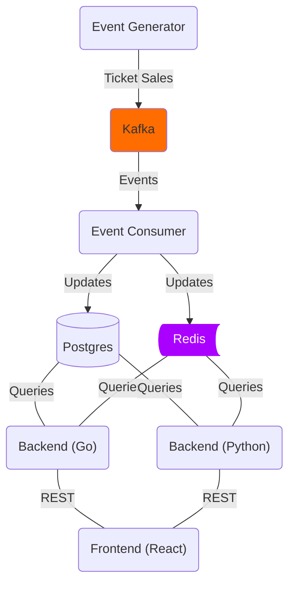

# ReelMetrics

**ReelMetrics** is a real-time ticket sales tracking system designed for movie theaters. It captures and processes ticket purchases as they happen, ensuring up-to-date sales data and analytics. The system is built with a **modular, microservices-based architecture**, using **Kafka** for seamless event communication, **PostgreSQL** for reliable data storage, and **Redis** for quick lookups. With both **Python (FastAPI)** and **Go** backends, ReelMetrics showcases a flexible, multi-language approach while delivering fast and accurate insights into theater performance and movie sales.


## Architecture Overview
ReelMetrics follows a microservices-based, event-driven design, where Kafka streams ticket sales to a consumer that updates PostgreSQL and Redis. The Go and Python (FastAPI) backends query both databases, exposing APIs for theater and sales data. A React frontend dynamically switches between backends and fetches analytics.

By separating event ingestion, storage, caching, and APIs, the system ensures efficient data flow, low-latency queries, and scalability.



## 🛠️ Tech Stack

  - **Backend (Python - FastAPI)**: Exposes APIs to fetch theaters & movie sales.
  - **Backend (Go)**: Alternative implementation for fetching the same data.
  - **PostgreSQL**: Stores theaters, movies, and sales data.
  - **Redis**: Caches frequently accessed data (e.g., top theaters, movie sales).
  - **Kafka**: Streams real-time ticket purchase events.
  - **Frontend (React)**: Displays theaters, movies, and sales statistics.

## **🧩 Project Components**

### **Event Generator**
- Generates **random ticket sales events**.
- Publishes events to **Kafka**.

### **Event Consumer**
- Listens for Kafka events in real time.
- Writes ticket sales to PostgreSQL and updates Redis for fast queries.

### **Backends (Python & Go)**
- **Fetch theaters & movie sales from PostgreSQL**.
- **Cache results in Redis** to optimize performance.

### **Frontend (React)**
- Lets users select between **Python & Go backends**.
- Displays **real-time revenue statistics**.

## **📦 Setup & Installation**

### **1️⃣ Clone the Repository**
```bash
git clone https://github.com/chiramlittleton/reelmetrics.git
cd reelmetrics
```

### **2️⃣ Start the Services with Docker**
```bash
docker-compose up -d
```

### **3️⃣ Verify Running Services**
```bash
docker ps
```

### **4️⃣ Test API Endpoints**

#### **Get Theaters (Python Backend)**
```bash
curl -X GET http://localhost:8001/theaters
```

#### **Get Movies & Sales for a Theater (`id=1`)**
```bash
curl -X GET http://localhost:8001/theaters/1/movies
```

#### **Get Top Theater by Revenue (Go Backend)**
```bash
curl -X GET http://localhost:8002/top-theater/2024-05-10
```

## **🔧 Development**
#### **Run Python Backend Locally**
```bash
cd backend_python
uvicorn main:app --host 0.0.0.0 --port 8001 --reload
```

#### **Run Go Backend Locally**
```bash
cd backend_go
go run main.go
```

#### **Run Event Generator**
```bash
cd utils
python event_simulator.py
```

## Continuous Integration & Deployment (CI/CD)

ReelMetrics uses **GitHub Actions** to automate testing, building, and deployment of the project. The CI/CD pipeline ensures that every commit and pull request maintains code quality and deploys updates seamlessly.

#### **CI/CD Workflow Overview**
- **Linting & Testing**: Runs unit tests and linter checks for both the **Go** and **Python** backends. (Linting not yet implemented)
- **Docker Build & Push**: Builds Docker images for the services and pushes them to a container registry.

#### **GitHub Actions Workflow**
The **CI/CD pipeline** is triggered on:
- **Pushes to `main`** – Runs tests and builds the project.
- **Pull Requests** – Ensures all code changes meet quality standards before merging.
- **Tag Creation** – Builds and pushes a new Docker image for deployment.

#### **How to Manually Trigger a Workflow**
To manually trigger a CI/CD workflow:
1. Navigate to the **Actions** tab in the GitHub repository.
2. Select the desired workflow.
3. Click **Run workflow** and provide any necessary parameters.

#### **Workflow Configuration**
The GitHub Actions workflows are defined in `.github/workflows/`. 

#### **Future Enhancements**
- Implement **automated rollbacks** for failed deployments.
- Integrate **Kubernetes deployment** for scalable orchestration.
- Enable **branch-specific deployments** for development and production environments.


## **📌 Next Steps**
- Add **user authentication** to restrict access.
- Implement **real-time WebSockets** for live sales updates.
- Deploy on **AWS using Kubernetes**.

## **📝 License**
This project is licensed under the MIT License.


### Screenshots

Below are some screenshots of the application in action.

#### 🎭 Theaters List


#### 🏆 Top Theater by Revenue


